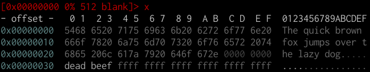
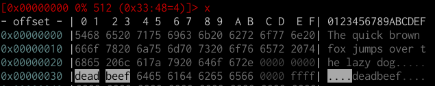
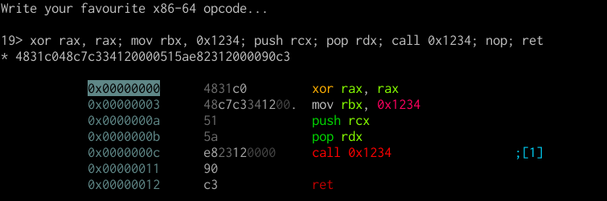

# Editing in r2

r2 can be used as a precise editor, which is very useful when patching files. A file needs to be opened with write permission via the `-w` option in order to do this.

Let's start with a blank file.

```
r2 -w blank
```

## Writing in command mode

There are plenty of write operations in radare2, all of them prefixed by `w`.

```
[0x00000000]> w?
|Usage: w[x] [str] [<file] [<<EOF] [@addr]
| w[1248][+-][n]     increment/decrement byte,word..
| w foobar           write string 'foobar'
| w0 [len]           write 'len' bytes with value 0x00
| w6[de] base64/hex  write base64 [d]ecoded or [e]ncoded string
| wa push ebp        write opcode, separated by ';' (use '"' around the command)
| waf file           assemble file and write bytes
| wao op             modify opcode (change conditional of jump. nop, etc)
| wA r 0             alter/modify opcode at current seek (see wA?)
| wb 010203          fill current block with cyclic hexpairs
| wB[-]0xVALUE       set or unset bits with given value
| wc                 list all write changes
| wc[ir*?]           write cache undo/commit/reset/list (io.cache)
| wd [off] [n]       duplicate N bytes from offset at current seek (memcpy) (see y?)
| we[nNsxX] [arg]    extend write operations (insert instead of replace)
| wf -|file          write contents of file at current offset
| wh r2              whereis/which shell command
| wm f0ff            set binary mask hexpair to be used as cyclic write mask
| wo? hex            write in block with operation. 'wo?' fmi
| wp -|file          apply radare patch file. See wp? fmi
| wr 10              write 10 random bytes
| ws pstring         write 1 byte for length and then the string
| wt file [sz]       write to file (from current seek, blocksize or sz bytes)
| ww foobar          write wide string 'f\x00o\x00o\x00b\x00a\x00r\x00'
| wx 9090            write two intel nops
| wv eip+34          write 32-64 bit value
| wz string          write zero terminated string (like w + \x00
```

Note that, like any other command, write operations will be performed relative to the current seek and block size (where applicable).

Let's write some random zero terminated string, and print it:

```
[0x00000000]> "wz The quick brown fox jumps over the lazy dog."
[0x00000000]> psz
The quick brown fox jumps over the lazy dog.
```

Relative offsets still work, so we could write anywhere we please without having to seek to that location beforehand:

```
[0x00000000]> wx deadbeef @ 0x30
[0x00000000]> p8 @ 0x30!4
deadbeef
```

## Editing in visual mode

Some edits are much better when performed in a visual context.

Let's switch to visual mode.



You can toggle the editing `cursor` using the `c` key. You can move the cursor around using the arrow keys or `hjkl`. It is recommended that you use the `hjkl` keys for reasons which will become obvious.

When turning the cursor on, you will notice that two vertical white borders appear surrounding the hex area. You can use `<TAB>` to toggle between editing this area and the plaintext one on the right.

Use `i` to insert hex values (when the cursor is in the hex zone) or plaintext.


### Yanking and pasting

Yanking (or, more commonly known as copying) and pasting hex/text can be done with the `y` and `Y` keys in visual mode. This is where the arrow keys/hjkl distinction plays a role.

You can select entire sequences of bytes by holding down `<Shift>` and moving the cursor via `hjkl` (arrow keys will most likely not work).




### Visual assembly

Let's set everything back to `00` by filling the entire first block with a "cyclic" pattern of zeros.

```
[0x00000000]> wb 00
```

Let's switch to disassembly view.


Another useful and powerful editing feature is the visual assembly editor. You can switch to it via `A`.



Notice how everything updates in real time.

You can also use the cursor in disassembly view, similar to how you do in the hex view, to quickly patch instructions.
