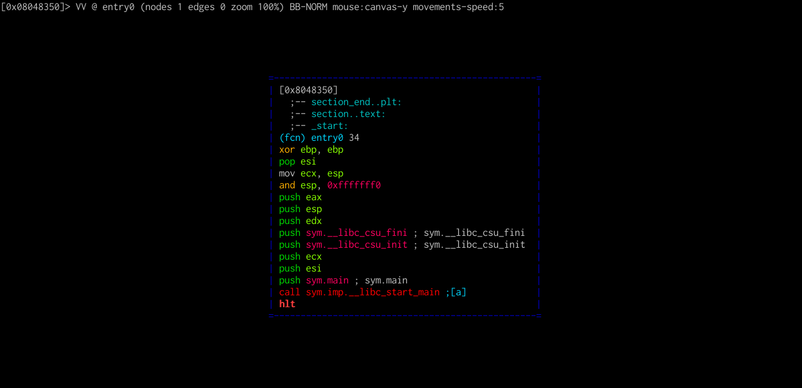
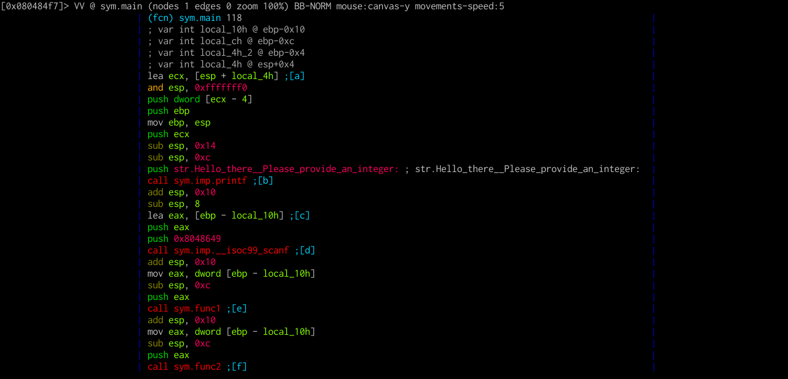
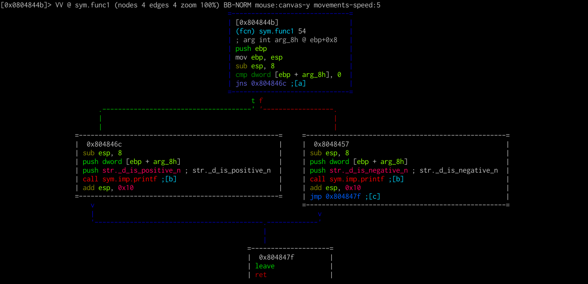
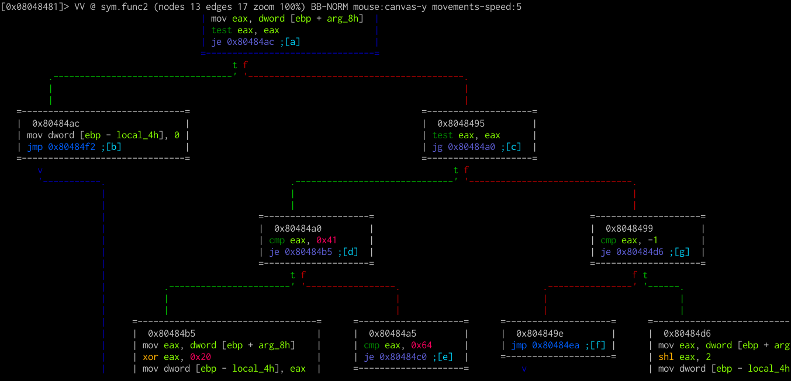
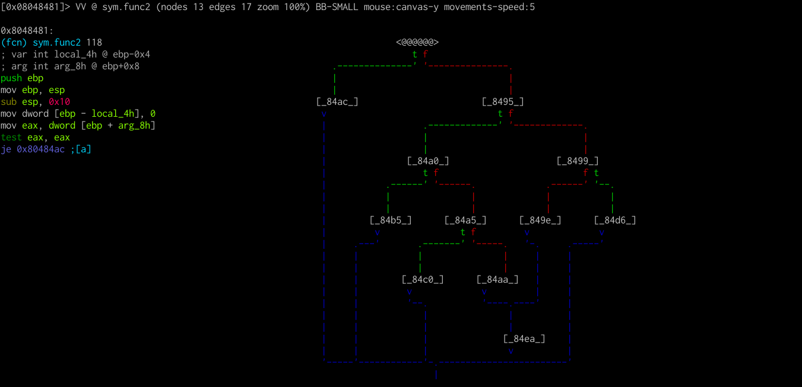
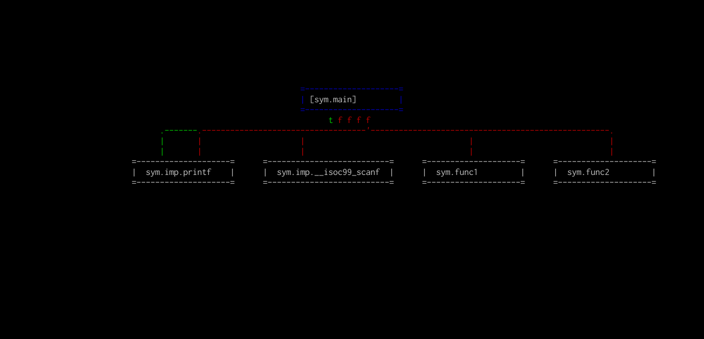
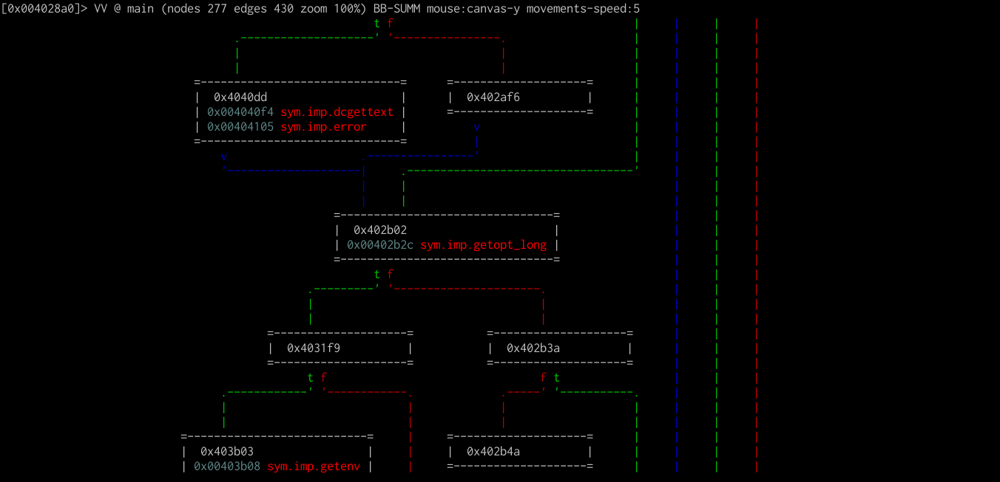

# Visual Graphs

While the visual mode offers a good amount of information for most practical applications, there is an ever better mode: visual graphs.

```
$ r2 -A ./hello
[x] Analyze all flags starting with sym. and entry0 (aa)
[x] Analyze len bytes of instructions for references (aar)
[x] Analyze function calls (aac)
[ ] [*] Use -AA or aaaa to perform additional experimental analysis.
[x] Constructing a function name for fcn.* and sym.func.* functions (aan))
 -- THE ONLY WINNING MOVE IS NOT TO PLAY.
 [0x08048350]> 
```

We can enter visual graphs mode by using `VV`



As always, a help menu for this mode can be accessed by pressing `?`.

```
Visual Ascii Art graph keybindings:
.            - center graph to the current node
:cmd         - run radare command
'            - toggle asm.comments
;            - add comment in current basic block
/            - highlight text
"            - toggle graph.refs
>            - show function callgraph (see graph.refs)
<            - show program callgraph (see graph.refs)
Home/End     - go to the top/bottom of the canvas
Page-UP/DOWN - scroll canvas up/down
C            - toggle scr.colors
hjkl         - scroll canvas
HJKL         - move node
tab          - select next node
TAB          - select previous node
t/f          - follow true/false edges
g([A-Za-z]*) - follow jmp/call identified by shortcut
G            - debug trace callgraph (generated with dtc)
r            - refresh graph
R            - randomize colors
o            - go/seek to given offset
u/U          - undo/redo seek
p/P          - rotate graph modes (normal, display offsets, minigraph, summary)
s/S          - step / step over
V            - toggle basicblock / call graphs
w            - toggle between movements speed 1 and graph.scroll
x/X          - jump to xref/ref
+/-/0        - zoom in/out/default
```

We can go to any offset just as in visual mode (`o` and then `main<Enter>`).



Notice that some instructions, such as `lea`, `jmp` or `call` are followed by short labels in square brackets. These labels, also known as shortcuts, are there to allow you to quickly go to them by using `g`. Let's go to `func1` via `ge`.



Notice that whenever the control flow changes on a condition, the ASCII graph branches. You can move the graph around using the `hjkl` keys. You can follow the flow using `t` and `f`, which stand for `true` and `false`, and undo movement using `u`.

Let's go back to `main`. We can do this quickly by pressing `x` and then `0`. `x` will bring up the functions from which `func1` is called (in our case, only `main`). Now let's go to `func2` with `gf`.



Notice that this function is noticeably larger and cannot fit on the screen. We can cycle display modes using `p/P`.



One last useful display is the callgraph of a function which, as the name suggests, contains the functions a certain function calls.

The callgraph for a function can be displayed by pressing `>`.



Sometimes, this callgraph can get pretty large, since functions can be called in various blocks. That's where the summary mode comes into play (one of the modes when cycling using `p/P`).



This display is very useful for getting the basic outline of what a program does at a more high level.
