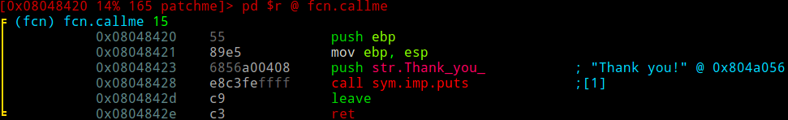

# Tutorial 1 - Simple Patch

Let's run our provided binary and see what happens.

```
./patchme
Hello there! Can you patch me up to call my function?
```

Hmm, it seems that it's asking us to patch it up. Let's first keep the original file as a backup.

```
cp patchme patchme_fix
```

and load this new file in radare2.

```
r2 -Aw patchme_fix
```

The previous command starts radare2, analyzes all functions/data/etc. (```-A```) and opens the file **patchme_fix** in write-mode (```-w```).

What you will be greeted with is a prompt of the following form:

```
[0x08048320]>
```

The value on the left side is (usually) the entry point of the binary. This can be configured, along with many other parameters in radare2, to be the **main** function, for example. But that is not our main focus for now.

Let's first figure out what this binary actually does. We can *seek* (change our position/point of view in the binary) using the seek command, as follows:

```
[0x08048320]> s main
[0x0804842f]>
```

> **Reminder: ** If you ever get confused about what a particular command does, append it with a question mark (**?**).

Example:
```
[0x0804842f]> s?
|Usage: s  # Seek commands
| s                 Print current address
| s addr            Seek to address
| s-                Undo seek
| s- n              Seek n bytes backward
| s--               Seek blocksize bytes backward
| s+                Redo seek
| s+ n              Seek n bytes forward
| s++               Seek blocksize bytes forward
| s*                List undo seek history
| s/ DATA           Search for next occurrence of 'DATA'
| s/x 9091          Search for next occurrence of \x90\x91
| s.hexoff          Seek honoring a base from core->offset
| sa [[+-]a] [asz]  Seek asz (or bsize) aligned to addr
| sb                Seek aligned to bb start
| sC string         Seek to comment matching given string
| sf                Seek to next function (f->addr+f->size)
| sf function       Seek to address of specified function
| sg/sG             Seek begin (sg) or end (sG) of section or file
| sn/sp             Seek next/prev scr.nkey
| so [N]            Seek to N next opcode(s)
| sr pc             Seek to register
```

This is as close as you can get to an official documentation, without having to explore the actual source code to find out what each little thing does.

Sadly, these little help snippets only briefly tell you what each thing does, but do not always provide examples for them.

Luckily, radare2's commands are very well organized and consistent. Each letter opens up a new pathway of commands. There are p(rint) commands, s(eek) commands, i(nfo) commands and so on.

Now, back to our exercise. Notice that the address on the left has changed. We are now at the start of the main function. We can check this by inputting **pdf** (**p**rint **d**isassemble **f**unction).

```
[0x0804842f]> pdf
╒ (fcn) main 20
│           ; DATA XREF from 0x08048337 (main)
│           ;-- main:
│           0x0804842f    55             push ebp
│           0x08048430    89e5           mov ebp, esp
│           0x08048432    6820a00408     push str.Hello_there__Can_you_patch_me_up_to_call_my_function_ ; "Hello there! Can you patch me up to call my function?" @ 0x804a020
│           0x08048437    e8b4feffff     call sym.imp.puts
│           0x0804843c    90             nop
│           0x0804843d    90             nop
│           0x0804843e    90             nop
│           0x0804843f    90             nop
│           0x08048440    90             nop
│           0x08048441    c9             leave
╘           0x08048442    c3             ret
```

It seems that all this program does is print the text message we saw earlier. However, it's asking us to call a function, and left us a trail of NOPs to overwrite.

But how do we find which function to call?

> **Reminder: ** When radare2 analyzes a file, it will add 'flags' to any relevant data/functions. You can view flags as labels which can later be used in radare commands and expressions (you can seek to flags, filter for flags, apply operations and so on.

Let's list some of the flags which radare2 automatically added for us.

```
[0x0804842f]> f
0x0804a020 54 str.Hello_there__Can_you_patch_me_up_to_call_my_function_
0x0804a056 11 str.Thank_you_
0x0804842f 20 main
0x08048320 34 entry0
0x08049ffc 4 reloc.__gmon_start___252
0x0804a00c 4 reloc.puts_12
0x0804a010 4 reloc.__gmon_start___16
0x0804a014 4 reloc.__libc_start_main_20
0x08049f10 0 obj.__JCR_LIST__
0x08048360 43 sym.deregister_tm_clones
0x08048390 53 sym.register_tm_clones
0x080483d0 30 sym.__do_global_dtors_aux
0x0804a061 1 obj.completed.6903
...
```

A more specific way to list functions is through **afl**.
We can't pinpoint any other function apart from **main**, however, we can see that there's a string "Thank you!" at address **0x0804a056**. Another way to find this string is by inspecting the strings in the binary with the command **iz** (info strings).

```
[0x0804842f]> iz
vaddr=0x0804a020 paddr=0x00001020 ordinal=000 sz=54 len=53 section=.data type=ascii string=Hello there! Can you patch me up to call my function?
vaddr=0x0804a056 paddr=0x00001056 ordinal=001 sz=11 len=10 section=.data type=ascii string=Thank you!
```

We can see if this string's address is being referenced anywhere via the command **axt** (**a**nalyze (**x**)reference **t**o).

```
[0x0804842f]> axt 0x0804a056
d 0x8048423 push str.Thank_you_
```

The string is being pushed onto the stack at address **0x8048423**. Let's seek there and see what's going on.

One nifty way to seek to that address is to use the output of the previous command.

```
[0x0804842f]> axt 0x0804a056~[1]
0x8048423
[0x0804842f]> s `axt 0x0804a056~[1]`
[0x08048423]>
```

> **Reminder: **The tilde (~) is radare's internal grep command, which can be used to select/filter output, much like **grep** is used in *NIX environments. The output can be thought of like an array of strings which are separated by whitespaces. Thus, the [1] will select the second (indexing begins at 0) string in the output of the axt command, which is the address in question. If we then surround the expression with backticks (`), then it will be expanded to its value when executed, similar to bash.

Let's do some exploring.

```
[0x08048423]> pdf
Cannot find function at 0x08048423
```
Hmm, it seems that we are not inside a function. It's time to navigate using visual mode (**Vp**).


We can navigate in this mode using the arrow keys or **hjkl**, similar to vim's take on navigation.

> Why use hjkl: the arrow keys aren't universal, so to speak. Different terminal emulators exhibit different behaviours when these are used in conjunction with Shift/Ctrl/Alt.

Just before **main** starts, we can see something similar to a function epilogue. If we move two instructions up, we can see the function's prologue.


Somehow, radare2 didn't manage to auto-analyze this for us. Explanation: since the function is not being called anywhere, it makes sense for radare to save some computing resources and not auto-analyze it for us. We're going to have to do this manually. Fortunately, this is pretty easy to do in visual mode.

> **Reminder: ** Radare's visual mode has a completely different set of key commands. These can be viewed by pressing **?**. "Regular" commands can still be entered by pressing "**:**"

To define function/data/code, we need to start by pressing '**d**'. A menu pops up asking us how we wish to define the current block. By pressing '**f**', we can tell radare that the data in the current block is a function and that we want it analyzed.

Radare will give it the name **fcn.08048420**, which comes from the fact that there's some function which begins at address **0x8048420**. Let's rename this function to something more usable.

We can input '**dr**' (**d**efine->**r**ename) to give our newly crafted function a proper name.



Now we can move down to the NOPs section in our main function to call **fcn.callme**. We can enter the awesome visual assembler by inputting '**A**'.


See how the five NOP instructions were magically replaced by our call to fcn.callme? Press enter twice and exit visual mode by pressing **q**, then exit radare2 by pressing **q** and enter.

Let's see if our patch works.

```
./patchme_fix
Hello there! Can you patch me up to call my function?
Thank you!
```

We can view our patch in summary using the **radiff2** tool.

```
radiff2 patchme patchme_fix
0x0000043c 9090909090 => e8dfffffff 0x0000043c
```
